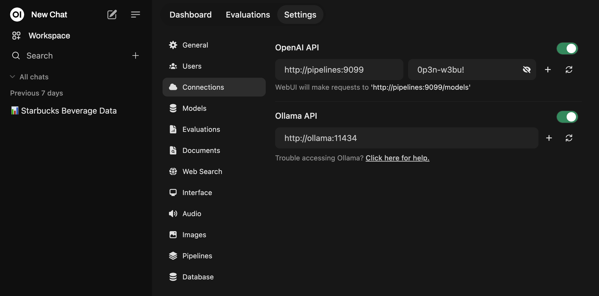

# Open WebUI - Pipelines Easy Deploy

A containerized service that manages and executes various data processing and AI pipelines. This service is part of the AI Stack ecosystem and provides a flexible architecture for running LangChain-based pipelines, data processing workflows, and custom AI integrations.

## Overview

The Pipelines Server is built on the [OpenWebUI Pipelines framework](https://github.com/open-webui/pipelines), a versatile plugin system that allows you to extend [OpenWebUI](https://github.com/open-webui/open-webui) with custom logic and Python libraries.

While the official OpenWebUI pipelines documentation is currently limited, we've compiled comprehensive documentation on pipeline usage and implementation in our [ai-stacks/docs/](../docs/) directory. Additionally, for practical examples and implementation guidance, we recommend checking out this excellent tutorial: [Extending OpenWebUI using Pipelines](https://zohaib.me/extending-openwebui-using-pipelines/).

## Getting Started with Sample Pipeline

To help you get started quickly, we provide a sample `pandas_df_agent` pipeline in the `pipelines/` directory. This pipeline, as demonstrated in one of our labs, serves as a practical example of implementing a custom function calling pipeline.

The included `deploy_pipelines_server.sh` script is particularly useful for deploying custom pipelines. Unlike manually adding pipelines through the OpenWebUI admin panel, this script automatically imports all Python files from the `pipelines/` directory during deployment. The script:
- Automatically discovers pipeline files in the `pipelines/` directory
- Mounts them into the Docker container
- Sets up the necessary environment variables
- Ensures proper installation of dependencies from requirements.txt

This automated approach makes it easier to manage and deploy multiple custom pipelines while maintaining version control of your pipeline implementations.

## Key Features

- 🔄 Dynamic pipeline discovery and loading
- 🐳 Containerized execution environment
- 📦 Automatic dependency management
- 🛠️ Support for various pipeline types (LangChain, Pandas, etc.)
- 🚀 FastAPI-powered REST endpoints
- 🔄 Automatic URL generation for pipelines

## Prerequisites

- Docker installed and running
- Port 9099 available on host
- Python 3.x (for local development)

## Installation

1. Clone the repository (if not already done):
   ```bash
   git clone git@github.com:aimug-org/austin_langchain.git
   cd ai-stacks/open-webui-pipelines
   ```

2. Ensure you have the necessary permissions:
   ```bash
   chmod +x deploy_pipelines_server.sh
   ```

3. Deploy the service:
   ```bash
   ./deploy_pipelines_server.sh
   ```

The deployment script will:
- Build the Docker container
- Install required dependencies
- Mount pipeline definitions
- Start the service on port 9099

## Configuration

### Environment Variables

The service can be configured through environment variables. Common configurations include:
- `PORT`: API port (default: 9099)
- Additional variables as needed for specific pipelines

### Connecting to Open WebUI

To connect your pipelines server to Open WebUI:

1. Navigate to the **Settings > Connections > OpenAI API** section in Open WebUI.
2. Set the API URL to `http://pipelines:9099` and the API key to `0p3n-w3bu!`.
3. Your pipelines should now be active.



### Adding New Pipelines

1. Create a new Python file in the `pipelines/` directory
2. Follow the pipeline structure conventions
3. Add any new dependencies to `requirements.txt`
4. Redeploy the service

## Usage

The service exposes REST endpoints for each pipeline at:
```
http://localhost:9099/pipeline/{pipeline_name}
```

### Example Pipeline Request

```bash
curl -X POST http://localhost:9099/pipeline/pandas_df_agent \
  -H "Content-Type: application/json" \
  -d '{"data": {...}, "query": "..."}'
```

## Monitoring

Monitor the service using Docker commands:
```bash
# View logs
docker logs pipelines

# Check service status
docker ps | grep pipelines
```

## Development

To develop new pipelines:

1. Create pipeline file in `pipelines/` directory
2. Follow LangChain patterns for implementation
3. Update `requirements.txt` if needed
4. Test locally before deployment
5. Deploy using the deployment script

## Integration

The Pipelines Server integrates with other AI Stack components through:
- HTTP API endpoints
- Shared file system mounts
- Environment configuration

## Troubleshooting

Common issues and solutions:

1. Service won't start:
   - Check if port 9099 is available
   - Verify Docker is running
   - Check service logs for errors

2. Pipeline not found:
   - Verify file is in correct directory
   - Check file naming convention
   - Review service logs for errors

3. Dependency issues:
   - Update requirements.txt
   - Rebuild container
   - Check Python version compatibility
