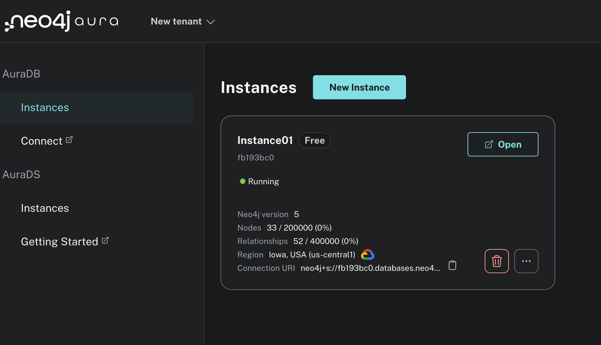

# Exploring Neo4j DevOps RAG
Source blog - https://neo4j.com/developer-blog/knowledge-graph-rag-application/
Source Notebook (I modified this a bit to work for Austin LangChain) https://colab.research.google.com/github/tomasonjo/blogs/blob/master/llm/devops_rag.ipynb#scrollTo=InL9Q99h3WAn
 
## External Dependancies
Hosted Neo4j aura - https://neo4j.com/cloud/aura/
I used the free tier for this exploration.

## create two new secrets in google_colab

NEO4J_PASSWORD - this is shown when you set up your instance
NEO4J_URI - this tells your code how to connect to the neo4j instance

