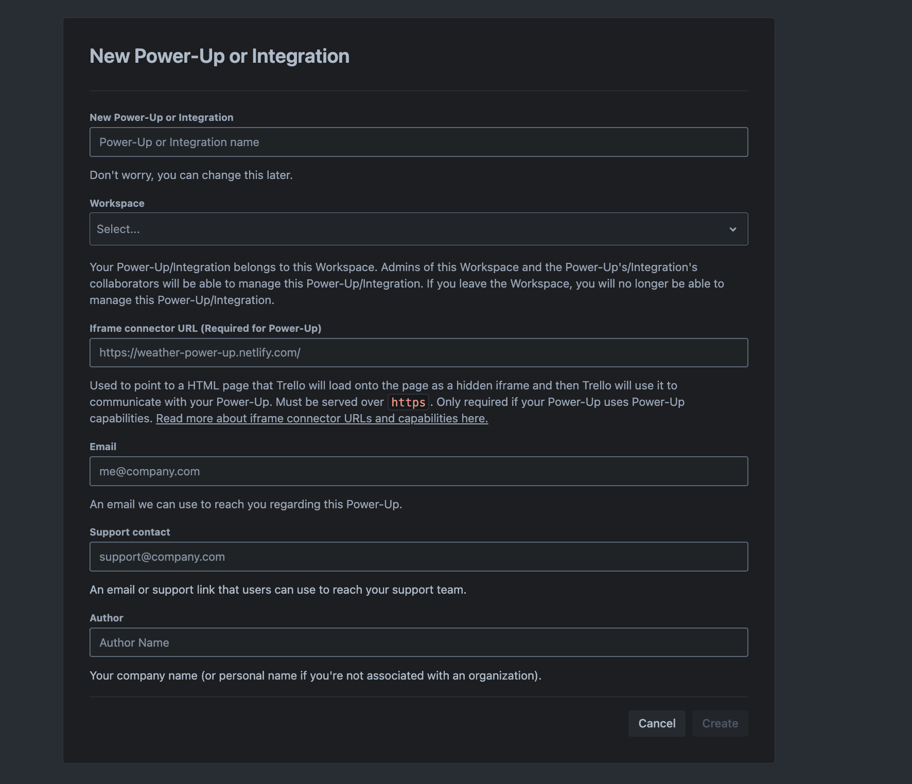

# 🎯 Trello MCP Server

An MCP server that provides tools for interacting with Trello boards and cards through the [Model Context Protocol](https://modelcontextprotocol.io/introduction).

For detailed information about developing MCP servers:

- [Python SDK Documentation](https://github.com/modelcontextprotocol/python-sdk)
- [Server Development Quickstart Guide](https://modelcontextprotocol.io/quickstart/server)

## 📋 Prerequisites

- 🐍 Python 3.11 or higher installed (as specified in uv.lock)
- 🚀 [uv](https://github.com/astral-sh/uv) package manager installed
- 📊 A Trello account
- 🔑 Trello API key and token

## 🛠️ Installation

Set up the development environment:

```bash
# Step 1: Create a new virtual environment
uv venv

# Step 2: Activate the virtual environment
# On Unix/macOS:
source .venv/bin/activate
# On Windows:
.venv\Scripts\activate

# Step 3: Install the package
uv pip install .
```

This will:

- Create a Python virtual environment
- Activate it for your terminal session
- Install dependencies from pyproject.toml

## 📁 Project Structure

```
src/
├── settings.py         # Environment and configuration management
├── trello_client.py    # Trello API client with error handling
├── trello_errors.py    # Custom error handling and exceptions
├── trello_schemas.py   # Pydantic models for request validation
└── server.py          # MCP server implementation with tools
```

## ⚙️ Configuration

### 🔐 Getting Trello Credentials

Trello's API uses token-based authentication to grant third-party applications access to the Trello API. To use the API, you need two things:

1. **TRELLO_API_KEY**: This is tied to a Power-Up, which is Trello's way of managing third-party applications. To get an API key:
   - Visit [Trello Power-Ups Admin](https://trello.com/power-ups/admin)
   - Create a new Power-Up (this represents your application)
   - Fill out this form
   
   - Navigate to the "API Key" tab
   - Generate a new API key
   - You should now see your `TRELLO_API_KEY` (API Key)

2. **TRELLO_TOKEN**: This grants your application permission to act on behalf of a user. To get a token:
   - Use your API key in this URL:
     ```
     https://trello.com/1/authorize?expiration=never&scope=read,write&response_type=token&key=YOUR_API_KEY
     ```
   - When a user visits this URL and clicks "Allow", they'll receive a token

For complete details on authorization, see the [official Trello API documentation](https://developer.atlassian.com/cloud/trello/guides/rest-api/authorization/).

### 🌍 Environment Variables

The following environment variables are required:

```
TRELLO_API_KEY=your_api_key
TRELLO_TOKEN=your_token
```

`src/settings.py` set default API endpoint to query Trello:

```
TRELLO_API_BASE_URL=https://api.trello.com/1  # Default API endpoint
```

## 🔧 MCP Settings Configuration

Add the TrelloMCP server configuration to your MCP settings file. The configuration is the same for both apps, just place it in the appropriate location:

- 🤖 Cline VSCode Extension: `~/Library/Application Support/Code/User/globalStorage/saoudrizwan.claude-dev/settings/cline_mcp_settings.json`
- 💻 Claude Desktop App: `~/Library/Application Support/Claude/claude_desktop_config.json`

```json
{
  "mcpServers": {
    "TrelloMCP": {
      "command": "uv", // Assumes uv is in PATH
      "args": [
        "--directory",
        "/path/to/trello-mcp/src", // Replace with your project's src directory
        "run",
        "server.py"
      ],
      "env": {
        "TRELLO_API_KEY": "your_api_key",
        "TRELLO_TOKEN": "your_token"
      }
    }
  }
}
```

## 🛠️ Available Tools

The server provides the following MCP tools:

### 📋 Board Operations

- 📊 `list_boards`: Get all boards for the authenticated user
- ➕ `create_board`: Create a new board
- 📑 `get_board_lists`: Get all lists from a specific board
- 📂 `get_board_lists_with_cards`: Get all lists and their cards from a board

### 📝 List Operations

- ➕ `create_list`: Create a new list in a board
- 📂 `get_list_cards`: Get all cards in a specific list

### 🗂️ Card Operations

- ➕ `create_card`: Create a new card in a list
- 🔄 `move_card`: Move a card between lists
- ✏️ `update_card`: Update card details (name, description, due date)
- 📥 `archive_card`: Archive a card

## ⚠️ Error Handling

The server includes comprehensive error handling:

- 🔒 Authentication errors
- ⏳ Rate limiting
- 🔍 Resource not found
- ✅ Validation errors
- 🚨 Server errors

All API calls include automatic retry logic for transient failures.

## 📝 Development Notes

- 🔧 The server uses Pydantic for configuration and request validation
- 🌐 HTTPX is used for HTTP requests
- 🔄 Automatic retries are implemented for API calls
- 📊 All operations return consistent response formats
- ⚡ Centralized error handling with standardized responses

## 💻 Local Development

To test the server locally using the MCP CLI:

```bash
# With required environment variables
TRELLO_API_KEY="your_api_key" TRELLO_TOKEN="your_token" mcp dev src/server.py --with-editable .

# Or if using environment variables from MCP settings file
mcp dev src/server.py --with-editable .
```

The server will start in development mode with:

- 🔄 Live reloading on file changes
- 🔍 Interactive inspector at http://localhost:5173
- 🐛 Detailed error messages and stack traces

You can test the server's functionality through:

1. 🌐 The MCP Inspector web interface
2. 🤖 Claude with proper MCP settings configuration
3. Direct HTTP requests to the local server
