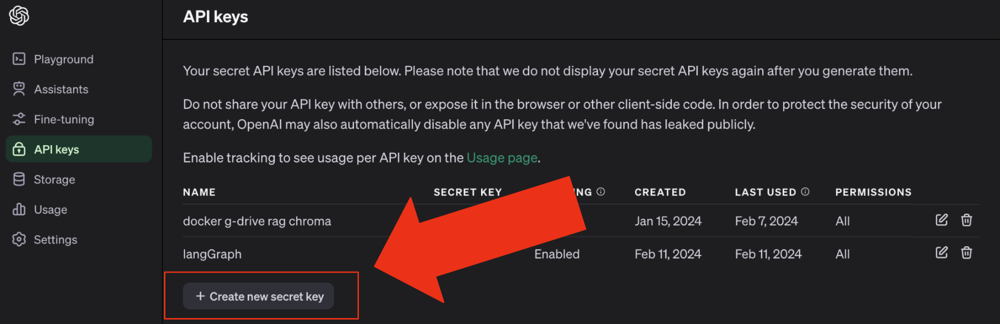
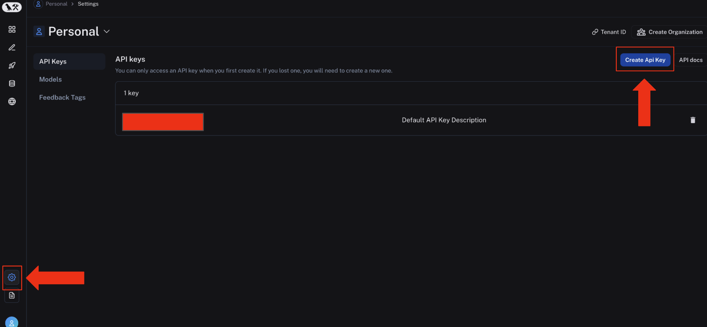
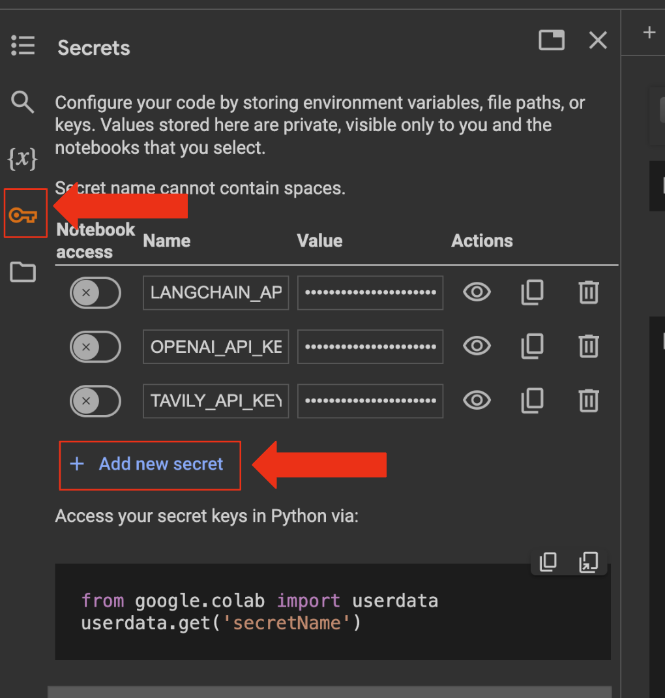
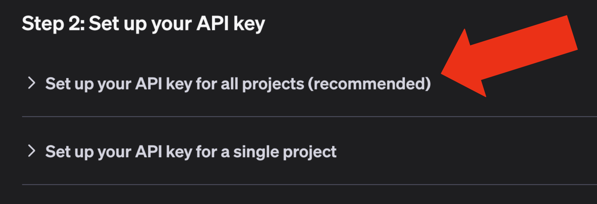

# Langchain Quick Start Guide

## Welcome to Austin LangChain!

This guide is designed to streamline your setup process, ensuring you're ready to dive into our in-person labs. Follow these instructions to familiarize yourself with the key resources we frequently use. This preparation will enhance your ability to actively participate and engage with the session's content.

## Setting Up Accounts

### Open AI
OpenAI, behind the groundbreaking ChatGPT, has been instrumental in elevating AI to the forefront of technology. In our LangChain projects, we frequently harness their models, which in some ways are foundational to much of LangChain's ecosystem. However, this reliance is evolving as our community expands this integration with open-source models, broadening our toolkit and possibilities. (We often showcase working with open source models in our labs)

If you do not have an OpenAI account yet, create one at [OpenAI Account Sign Up](https://platform.openai.com/signup). This account is necessary for generating your API key.

Then navigate to "API Keys" and generate a new key. Store it somewhere safe for now.

(Note: Do not share keys - use with caution)



### LangSmith

LangSmith, developed by [LangChain](https://www.langchain.com/langsmith), is a versatile DevOps platform providing visibility into the sequence of calls in your LangChain applications as they interact with our AI models, a feature pivotal for debugging.

At Austin LangChain, we frequently leverage LangSmith during our lab sessions. Its ability to offer full visibility and traceability makes it an indispensable tool for our development process, allowing us to swiftly identify and showcase what is happening under the hood during our labs.

Learn more about how LangSmith at [LangChain's LangSmith Page](https://www.langchain.com/langsmith).

If you do not have a LangSmith account yet, create one at [LangSmith Account Sing Up](https://smith.langchain.com/)

Once logged in, go to "Settings" and click on "Create API Key". Store it somewhere safe for now.

(Note: Do not share keys - use with caution)




### Google Colab
Google Colab is a free cloud-based platform that lets you write and execute Python code through your browser. At Austin LangChain, we use Colab to write, share, and explain code in real-time during our labs.

This approach allows everyone to follow along with the concepts we're learning about LangChain, without needing any special setup on their personal computers. It's an ideal tool for collaborative learning and experimentation, ensuring that everyone, regardless of their hardware, can participate fully in our sessions.

Setting up a Google Colab account is straightforward and only takes a few steps:

1. **Google Account:** Ensure you have a Google account. If not, you can create one [here](https://accounts.google.com/signup).

2. **Access Google Colab:** Visit [Google Colab](https://colab.research.google.com) and sign in with your Google account credentials.

3. **Open a Notebook:** Once logged in, you can open an existing notebook from Google Drive, GitHub, or by uploading a file. To test if your setup works and familiarize yourself with our labs, follow this link to one of our early labs: [LangChain 101-1: Streamlit Streaming Lab](https://colab.research.google.com/github/colinmcnamara/austin_langchain/blob/main/labs/LangChain_101/101-1-streamlit_streaming.ipynb).

## Setting Up Environment Variables (Keys / Secrets)
In our projects, we frequently utilize environment variables, such as the OpenAI API Key, for accessing OpenAI models. Depending on the lab, there will be two environment types in which we will often use keys:

1. Google Colab
2. Your own machine

### Google Colab

Setting up secrets in Colab is easy. Simply click on the key icon in the sidebar and follow the instructions. Note that once you add a key, it persists across all your Colab notebooks in your Google account, which is highly beneficial.



Note that you can access secrets in your notebooks like this:

```
from google.colab import userdata
openai_api_key = userdata.get('OPENAI_API_KEY')
```

During our labs, we've already got these steps covered in our notebooks! You'll jump straight into the action, playing with the latest and greatest LangChain tech that we've been tinkering with at Austin LangChain. It's like having a VIP pass to the AI playground! 🚀✨

### Your Own Machine

Alternatively, you can set up your secrets in your own machine in accordance to your operating system.

To do so, follow the instructions provided in the [OpenAI Platform Documentation](https://platform.openai.com/docs/quickstart/step-2-set-up-your-api-key).

We strongly encourage you to set up environment variables globally as it's much easier to keep track of them across all your projects.



## Setting up Docker

Docker is widely celebrated for its ability to simplify the workflows of developers, and it's a tool we frequently utilize at Austin LangChain. Take a look at our [Intro to Docker](../../labs/LangChain_103/103-1-docker_introduction.md) tutorial to see why we love using it in our LangChain projects.

For now, just make sure to have Docker Desktop installed in your operating system by visiting [Docker Desktop](https://www.docker.com/products/docker-desktop/).
